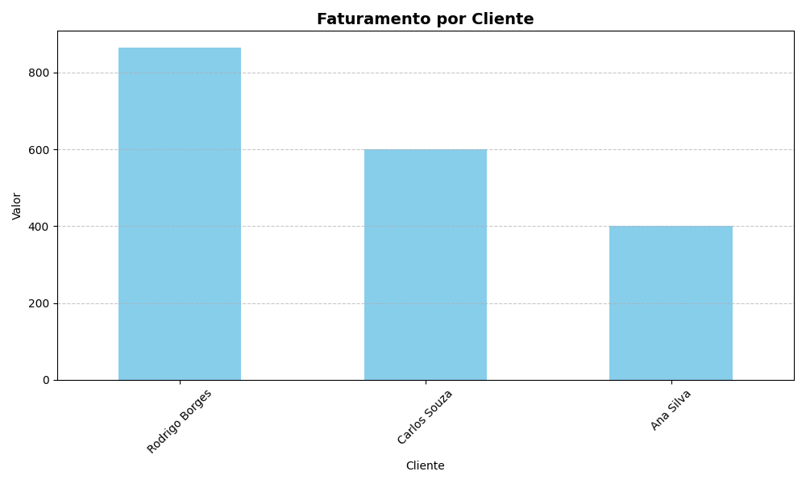
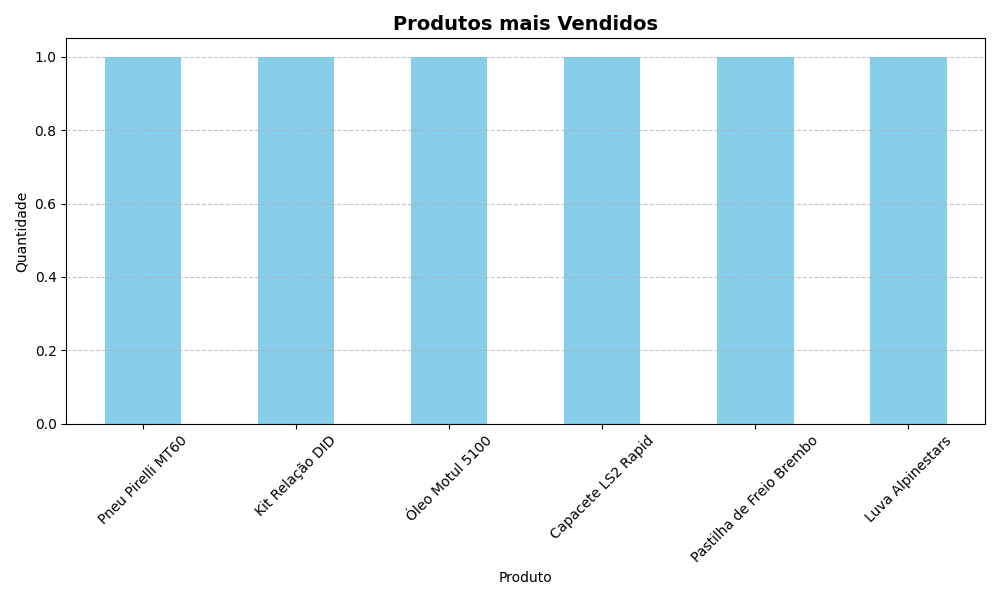
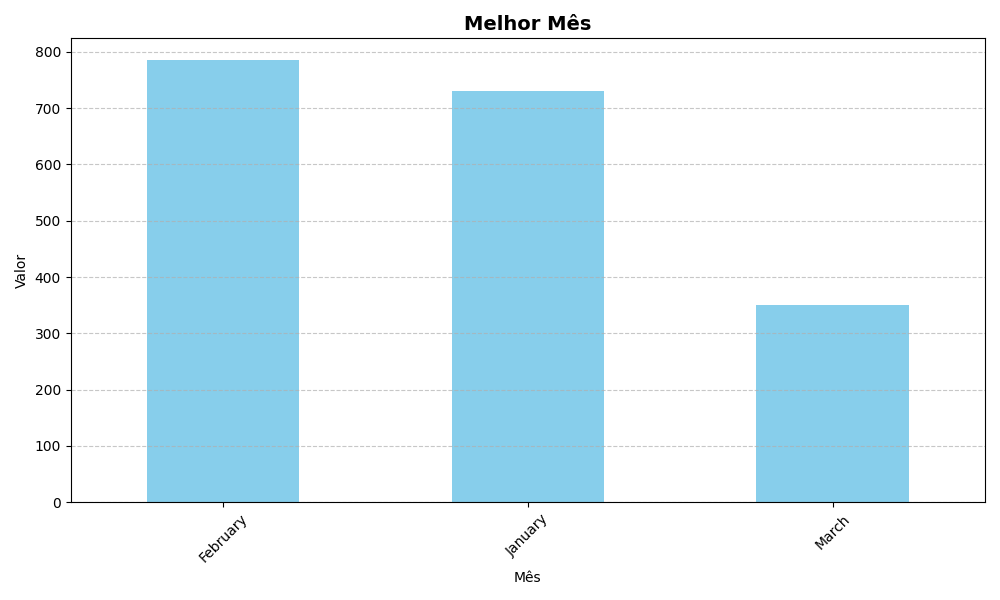

```markdown
# SalesInsight-ETL 🚀

O SalesInsight-ETL é uma ferramenta de automação que transforma dados brutos de vendas (JSON) em inteligência de negócio,
utilizando um pipeline ETL (Extract, Transform, Load) completo com Python, SQL e Data Visualization.

---

## 📂 Estrutura do Projeto

```text
SalesInsight-ETL/
├── data/                       # Gerenciamento de arquivos de dados
│   ├── raw/                    # JSON original (vendas_brutas.json)
│   ├── processed/              # (Local) Banco SQLite gerado pelo sistema
│   └── screenshots/            # Imagens dos gráficos para documentação
├── src/                        # Código-fonte modularizado
│   ├── __init__.py
│   ├── database.py             # Integração com SQLite (DML/DDL)
│   ├── processor.py            # Limpeza e transformação com Pandas
│   ├── analyzer.py             # Lógica de negócio e calculo de rankings
│   └── visualizer.py           # Geração de gráficos com Matplotlib
├── main.py                     # Maestro: Interface via terminal para o usuário
├── config.py                   # Centralização de caminhos e constantes
├── requirements.txt            # Dependências (pandas, matplotlib)
└── README.md                   # Documentação do projeto
```

---

## 🛠️ Tecnologias Utilizadas

* **Python 3.x**: Linguagem base.
* **Pandas**: Manipulação e tratamento de dados.
* **SQLite**: Armazenamento relacional dos dados processados.
* **Matplotlib**: Visualização de dados e geração de gráficos.

---

## 📊 Demonstração dos Resultados

O sistema gera automaticamente insights visuais sobre o desempenho das vendas:

### Faturamento por Cliente


### Produtos mais Vendidos


### Desempenho Mensal


---

## 🚀 Como Executar

1. Certifique-se de ter o Python instalado.
2. Instale as dependências:
   ```bash
   pip install -r requirements.txt
   ```
3. Execute o sistema:
   ```bash
   python main.py
   ```

---
**Desenvolvido por [Rodrigo Borges/rodrigo-borgesj]** - Focado em Engenharia de Dados e Automação.
